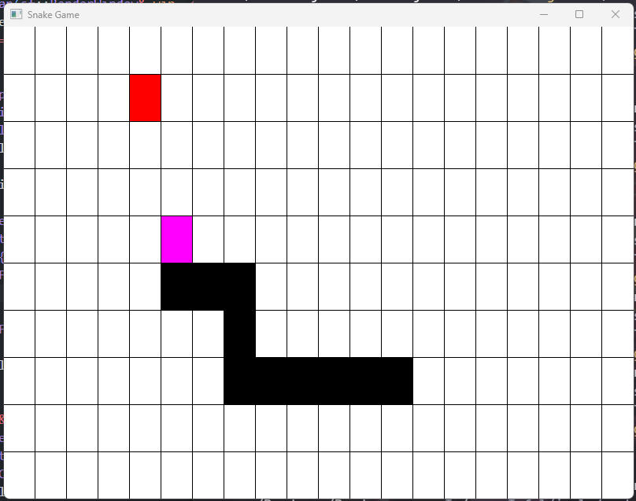

# SnakeGame

## CLI

g++ src/main.cpp src/Game/Game.cpp src/Renderer/Renderer.cpp -I. -o snake

## SFML

g++ src/main.cpp src/Game/Game.cpp src/Renderer/Renderer.cpp -I./src -Isfml/include -Lsfml/lib -o bin/myprogram.exe -lsfml-graphics -lsfml-window -lsfml-system -lsfml-audio
